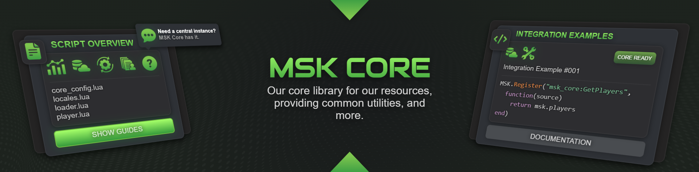
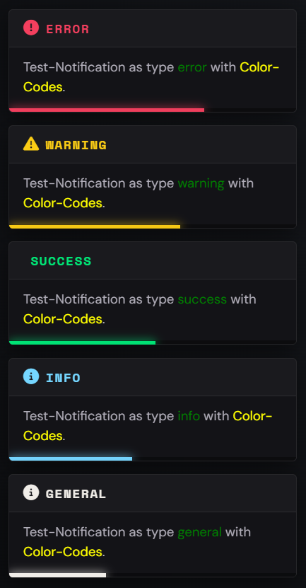
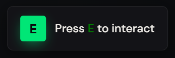
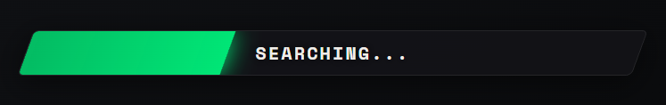
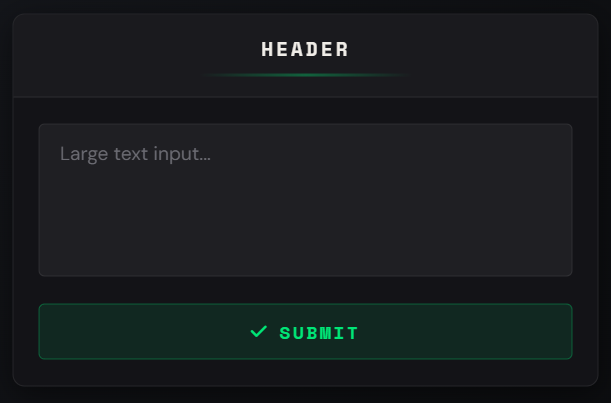
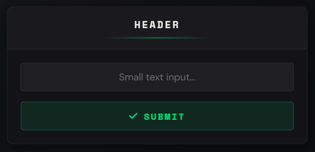
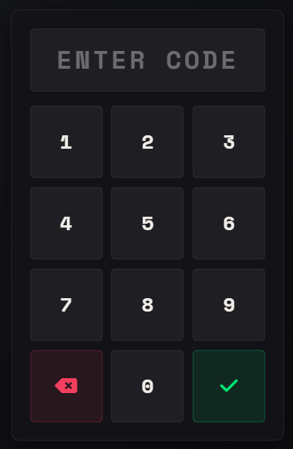
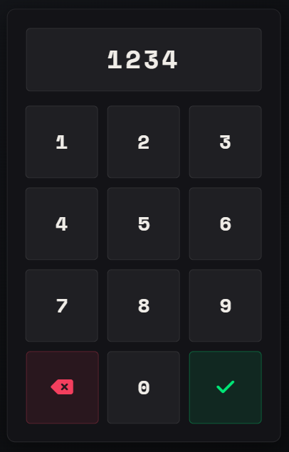

<div align="center">

**The shared library behind every MSK Scripts resource.**

[](https://discord.gg/5hHSBRHvJE)
[](https://docu.msk-scripts.de/docs/msk_core/)
[](https://github.com/MSK-Scripts/msk_core/releases)
[](LICENSE)

[Discord](https://discord.gg/5hHSBRHvJE) · [Documentation](https://docu.msk-scripts.de/docs/msk_core/) · [Releases](https://github.com/MSK-Scripts/msk_core/releases)

</div>

---

**MSK Core** gives you a clean framework abstraction (ESX, QBCore, ox_core — or fully **STANDALONE**), a modern React-based NUI and a large set of helper functions, all exposed through a single global `MSK` table that any resource can import in one line.

## ✨ Features

- **Framework bridge** — write once, run on ESX / QBCore / ox_core / STANDALONE (`Config.Framework = 'AUTO'`)
- **Inventory bridge** — `ox_inventory`, `core_inventory`, `jaksam_inventory`, ESX/Chezza `default`, or your own `custom`
- **Lazy-loaded modules** — a module is compiled into your resource only when you first use it
- **Modern NUI** — Notify, Input, Numpad, Progressbar & TextUI (React + Vite + TypeScript, fully offline/bundled)
- **Dual API** — every function is available as `MSK.Function(...)` **and** `exports.msk_core:Function(...)`
- **Utilities** — callbacks, cron jobs, ace permissions, commands, Discord webhooks, version & dependency checks, math/string/table/vector helpers and more

## 📦 Requirements

* [oxmysql](https://github.com/overextended/oxmysql)

### Optional

* [ESX 1.9.2+](https://github.com/esx-framework/esx_core) / [QBCore](https://github.com/qbcore-framework/qb-core) / ox_core — for framework-based functions
* [ox_inventory](https://github.com/overextended/ox_inventory) / core_inventory / [jaksam_inventory](https://forum.cfx.re/t/jaksams-inventory-create-items-in-game/5388694) — for inventory-based functions

## 🚀 Installation

1. Download the latest [release](https://github.com/MSK-Scripts/msk_core/releases) and drop `msk_core` into your `resources` folder.
2. Make sure it starts **after** your framework/inventory and **before** any resource that uses it:

```ini
ensure oxmysql
ensure es_extended      # or qb-core / ox_core (optional)
ensure ox_inventory     # or another inventory (optional)
ensure msk_core
```

> ⚠️ **Lua 5.4 is required.** Every resource that imports the core must set `lua54 'yes'` in its `fxmanifest.lua`.

## 🔌 Usage

Add the import to **your** resource's `fxmanifest.lua`:

```lua
lua54 'yes'

shared_script '@msk_core/import.lua'
```

You now have the global `MSK` table everywhere in that resource:

```lua
-- Notification
MSK.Notification('MSK Scripts', 'Welcome to my server!', 'success', 5000)

-- Server callback (client side)
local money = MSK.Trigger('myscript:getMoney', 'bank')

-- Players
local players = MSK.GetPlayers()
```

Everything is also available as an export:

```lua
exports.msk_core:Notification('Title', 'This is a Notification', 'general', 5000)
```

### Eager loading (optional)

Modules load on first use. To compile one up front, list it in your `fxmanifest.lua`:

```lua
shared_script '@msk_core/import.lua'

msk_core 'Callback'
msk_core 'Player'
```

## 🖼️ UI

| | |
|---|---|
| **Notification** |  |
| **TextUI** |  |
| **Progressbar** |  |
| **Input** |   |
| **Numpad** |   |

## 🛠️ Developing the NUI

The NUI lives in `web/` (React + Vite + TypeScript + Tailwind v4). The **built** `web/dist` is committed, so the server never needs npm.

```bash
cd web
npm install
npm run dev     # browser dev with the DevPanel
npm run build   # rebuild web/dist — commit it after UI changes
```

## 📚 Documentation

Full API reference: **[docu.msk-scripts.de/docs/msk_core](https://docu.msk-scripts.de/docs/msk_core/)**

## 📄 License

msk_core is licensed under the **GNU Lesser General Public License v3.0 or later** (LGPL-3.0-or-later).

This means the core itself is open and must stay open, but **any** resource — free or paid — may use msk_core as a dependency without being forced to adopt the same license. See [LICENSE](LICENSE) (and [GPL-3.0.txt](GPL-3.0.txt), which the LGPL incorporates).

The names, logos, and brands **"MSK Scripts"** and **"Musiker15"** are trademarks of the Licensor and are not covered by the LGPL.

<div align="center">

Made with 💚 by **MSK Scripts | Musiker15**

</div>
