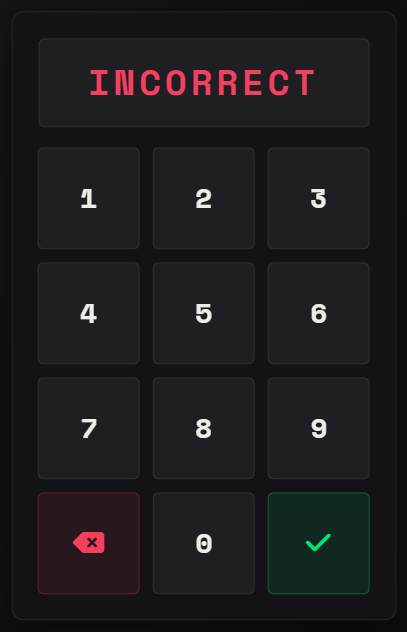
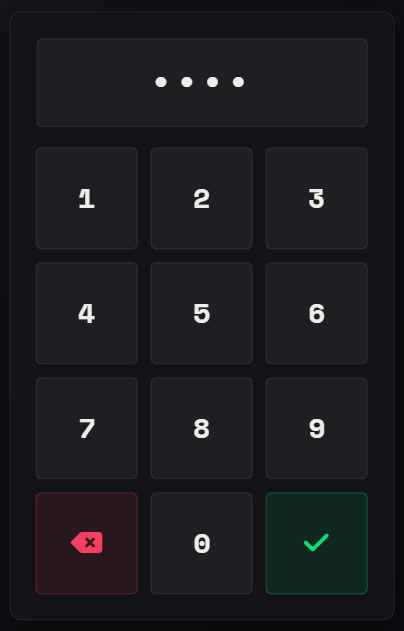

[MSK Scripts Discord](https://discord.gg/5hHSBRHvJE)

[Documentation](https://docu.msk-scripts.de/docs/msk_core/)

## Requirements
* [oxmysql](https://github.com/overextended/oxmysql)

### Optional Requirements
* [ESX 1.9.2 and above](https://github.com/esx-framework/esx_core) or [QBCore](https://github.com/qbcore-framework/qb-core) -> This is only for **Framework based** functions *(bridge folder)*
* [ox_inventory](https://github.com/overextended/ox_inventory) or [jaksam_inventory](https://forum.cfx.re/t/jaksams-inventory-create-items-in-game/5388694) -> This is only for **Inventory based** functions *(inventory folder)*

## MSK.Notification

## MSK.TextUI

## MSK.Progressbar

## MSK.Input

## MSK.Numpad

